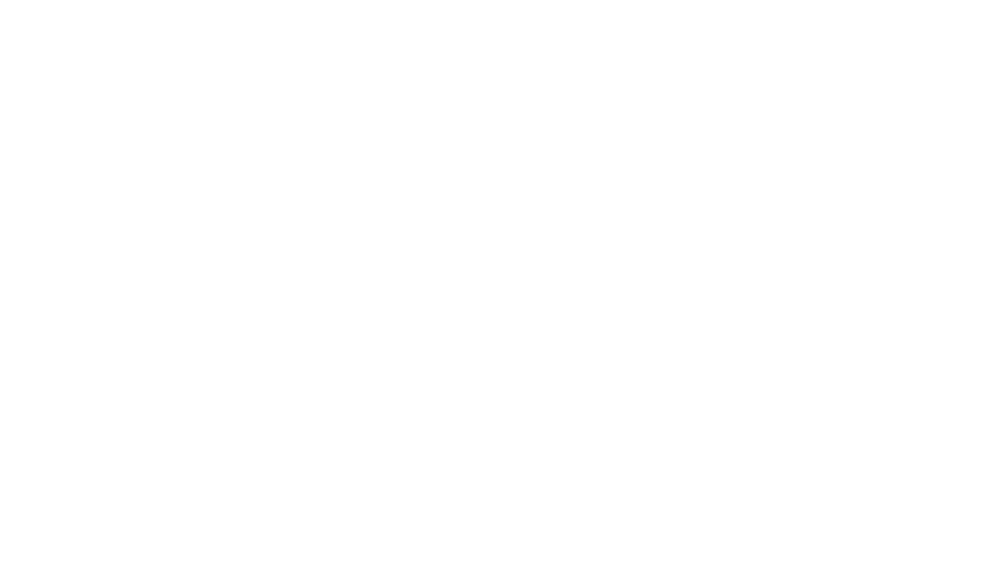

# AsciiArt Lambda Function

AWS lambda function created with the SAM CLI.
It creates Ascii art from an image, then saves it in s3 and returns a pre-signed url.

### Sample request
**Content-Type**: multipart/form-data \
**Request type**: POST \
**Endpoint**: [APP_HOST]/convert-and-save \
### Payload
- **image**: binary\
- **inverted**: text *(1 or 0)* \
- **color**: text *[black, white, blue, green, red, yellow, dark-gray, light-gray]*
- **height**: int *(if 0, it'll roughly match the image size)*

Author: Roland Treiber \
Email: hello@thecaringdeveloper.com